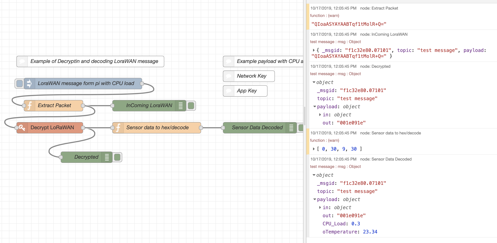

# LoRaWAN Packet Decrypter using Network & App keys

This node needs the network key and the app key to decrypt a LoraWan message/payload. Input is the payload with the data as ASCII in msg.payload like 'QIoaASYAYAABTqf1tMolR+Q='' which will be the decryped as a message in HEX like '001e091e' in msg.payload.out - see image below or check or check for more
 <a href='https://github.com/markusvankempen/LoraWAN-Traffic-Decrypt-and-Decode-using-Node-RED '>here</a> and 
 <a href='https://learn.adafruit.com/using-lorawan-and-the-things-network-with-circuitpython?view=all'>here</a> 
 
 


## Installation
npm -g install node-red-contrib-lorawan-packet-decrypt-nwkey-appkey

### Example Node-RED flow

**With an inject node and a debug node.**

```
[{"id":"e3322e49.7b59f","type":"tab","label":"LoraWAN Decrypt","disabled":false,"info":""},{"id":"cd91624b.2fa5c","type":"debug","z":"e3322e49.7b59f","name":"Decrypted","active":true,"tosidebar":true,"console":false,"tostatus":false,"complete":"true","targetType":"full","x":310,"y":460,"wires":[]},{"id":"b449b928.92c388","type":"function","z":"e3322e49.7b59f","name":"Extract Packet","func":"devid=\"12345678901 \"\n\n// the lora lora-packet-converter package expect device id (12) as a string before the Lora wan Packet\nmvk=msg.payload.data.rxpk[0].data // from the injection \nnode.warn(mvk)\n//test={\"rxpk\":[{\"data\":\"QIoaASYAYAABTqf1tMolR+Q=\",\"time\":\"2019-10-16T02:43:52.558399Z\",\"chan\":0,\"tmst\":110465012,\"stat\":1,\"modu\":\"LORA\",\"lsnr\":1,\"rssi\":-113,\"rfch\":0,\"codr\":\"4/5\",\"freq\":903.9,\"datr\":\"SF7BW125\",\"size\":17}]}\n//msg={}\nmsg.payload=mvk\n\nreturn msg;","outputs":1,"noerr":0,"x":220,"y":320,"wires":[["a0b02dbe.69862","b34f45d7.9b6328"]]},{"id":"d9a7e541.245dd8","type":"inject","z":"e3322e49.7b59f","name":"LoraWAN message form pi  with CPU load","topic":"test message","payload":"{\"value\":\"hello\",\"type\":\"dev\",\"msgid\":0,\"data\":{\"rxpk\":[{\"data\":\"QIoaASYAYAABTqf1tMolR+Q=\",\"time\":\"2019-10-16T02:43:52.558399Z\",\"chan\":0,\"tmst\":110465012,\"stat\":1,\"modu\":\"LORA\",\"lsnr\":1,\"rssi\":-113,\"rfch\":0,\"codr\":\"4/5\",\"freq\":903.9,\"datr\":\"SF7BW125\",\"size\":17}]}}","payloadType":"json","repeat":"","crontab":"","once":false,"onceDelay":0.1,"x":300,"y":260,"wires":[["b449b928.92c388"]]},{"id":"7055b83c.074f68","type":"function","z":"e3322e49.7b59f","name":"Sensor data to hex/decode","func":"\nbytes=msg.payload.out // sensor/LoraWAN data playload\n\nnewbytes=Buffer.from(bytes, 'hex')\nnode.warn(newbytes) ///yeah\n\n//decode ...payload\n//https://learn.adafruit.com/using-lorawan-and-the-things-network-with-circuitpython?view=all\n\nCPU_Load = (newbytes[0] << 8) | newbytes[1];\noTemperature = (newbytes[2] << 8) | newbytes[1];\n   \nmsg.payload.CPU_Load = CPU_Load / 100;\nmsg.payload.oTemperature = oTemperature / 100;\n  \nreturn msg;\n\n\n\n\n\n\n\n\n\n\n\n\n\n\n\n\n","outputs":1,"noerr":0,"x":500,"y":380,"wires":[["71678020.4fb4d"]]},{"id":"ed2894f.322f168","type":"comment","z":"e3322e49.7b59f","name":"Example of Decryptin and decoding LoraWAN message","info":"Note:\nI use the APP & network key form TheThinkNetwork\n\nmy Hardware was a pycom LoPY as Single Channel Gateway\nand a Lora PI Bonnet using python\nhttps://learn.adafruit.com/using-lorawan-and-the-things-network-with-circuitpython?view=all\n\nI want to send the Lora Message directly via mqtt to node-red and process\nthem there with out the need of a loraWAN server\n\n\nhere a good link for testing\nhttps://lorawan-packet-decoder-0ta6puiniaut.runkit.sh\nhere more infos\nhttps://github.com/anthonykirby/lora-packet/blob/master/demo/demo1.js\nmore infos\nhttps://forum.pycom.io/topic/3958/how-decrypt-lora-data/3\nhttps://codebeautify.org/string-hex-converter","x":320,"y":200,"wires":[]},{"id":"71678020.4fb4d","type":"debug","z":"e3322e49.7b59f","name":"Sensor Data Decoded","active":true,"tosidebar":true,"console":false,"tostatus":false,"complete":"true","targetType":"full","x":780,"y":380,"wires":[]},{"id":"a0b02dbe.69862","type":"debug","z":"e3322e49.7b59f","name":"InComing LoraWAN","active":true,"tosidebar":true,"console":false,"tostatus":false,"complete":"true","targetType":"full","x":480,"y":320,"wires":[]},{"id":"7a41cd57.b1ce94","type":"comment","z":"e3322e49.7b59f","name":"Example payload with CPU and temp","info":"{\n    \"value\": \"hello\",\n    \"type\": \"dev\",\n    \"msgid\": 0,\n    \"data\": {\n        \"rxpk\": [\n            {\n                \"data\": \"QIoaASYAYAABTqf1tMolR+Q=\",\n                \"time\": \"2019-10-16T02:43:52.558399Z\",\n                \"chan\": 0,\n                \"tmst\": 110465012,\n                \"stat\": 1,\n                \"modu\": \"LORA\",\n                \"lsnr\": 1,\n                \"rssi\": -113,\n                \"rfch\": 0,\n                \"codr\": \"4/5\",\n                \"freq\": 903.9,\n                \"datr\": \"SF7BW125\",\n                \"size\": 17\n            }\n        ]\n    }\n}","x":830,"y":200,"wires":[]},{"id":"a819c4e6.287908","type":"comment","z":"e3322e49.7b59f","name":"Network Key","info":"27E87B6710ACC5FB9098F19AE77DC62B","x":750,"y":240,"wires":[]},{"id":"f0f1f445.6237e8","type":"comment","z":"e3322e49.7b59f","name":"App Key","info":"B887FD00569BE0746E8020746EFC9BA8","x":740,"y":280,"wires":[]},{"id":"b34f45d7.9b6328","type":"lorawan-packet-decrypt-nwkey-appkey","z":"e3322e49.7b59f","name":"Decrypt LoRaWAN","nsw":"27E87B6710ACC5FB9098F19AE77DC62B","asw":"B887FD00569BE0746E8020746EFC9BA8","x":210,"y":380,"wires":[["cd91624b.2fa5c","7055b83c.074f68"]]}]
```


## Features
- decrypts msg.payload  into msg.payload.out (msg.payload.in )
- msg.payload.buffers has all information about packet, especially DevAddr.



### Reference
- https://github.com/scne/node-red-contrib-lora-packet-converter
- https://www.npmjs.com/package/lora-packet

### Author
mvk@ca.ibm.com / markus@vankempen.org 

### Version 
- Initial 2019-Oct-17
- Update: 2021-Mar-21
